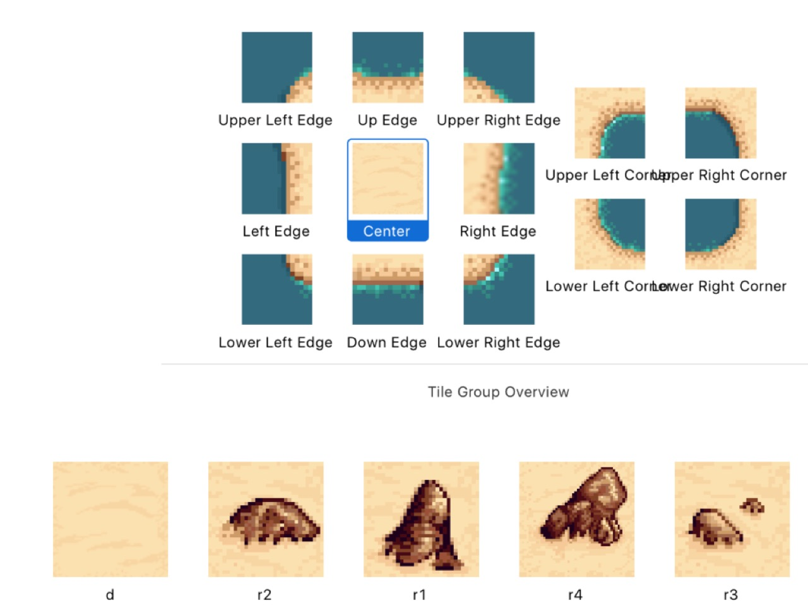

Copied from [ZBeyer.com]()

QUICK DISCOVERY—PANNING & PINCH ZOOMING FOR SKCAMERANODES
=========================================================

[Zachary Beyer](http://www.zbeyer.com/author/zbeyer/)[12/22/2017 (Fri, December 22, 2017 )](http://www.zbeyer.com/quick-discovery-panning-pinch-zooming-for-skcameranodes/)

### DEMO

<iframe width="720" height="400" src="https://www.youtube.com/embed/YV43_jf1DKs" frameborder="0" allow="accelerometer; autoplay; encrypted-media; gyroscope; picture-in-picture" allowfullscreen></iframe>


Used a few crops from Desert Tileset provided by MrBeast at Open Game Art: <https://opengameart.org/content/desert-tileset-0>

I confess I sort of botched the image cropping a bit—was in a rush:

[](http://www.zbeyer.com/wp-content/uploads/2017/12/Screen-Shot-2017-12-23-at-4.23.08-PM.jpg)Image crops from Open Game Art: https://opengameart.org/content/desert-tileset-0

### CODE:

```
    var playerNode:SKNode {
        return self.childNode(withName: "playerNode")!
    }
    
    var playerCamera: SKCameraNode {
        return self.playerNode.childNode(withName: "playerCamera") as! SKCameraNode
    }
    
    override func sceneDidLoad() {
        self.lastUpdateTime = 0
    }
    
    override func didMove(to view: SKView) {
        
        let pinchGesture = UIPinchGestureRecognizer(target: self, action: #selector(handlePinchFrom(_:)))
        
        self.view?.addGestureRecognizer(pinchGesture)
        
    }
    
    func pointSubtract(_ a: CGPoint, _ b: CGPoint) -> CGPoint {
        let xDelta = a.x - b.x
        let yDelta = a.y - b.y
        return CGPoint(x:xDelta, y:yDelta)
    }
    
    func pointAdd(_ a: CGPoint, _ b: CGPoint) -> CGPoint {
        let xDelta = a.x + b.x
        let yDelta = a.y + b.y
        return CGPoint(x:xDelta, y:yDelta)
    }

    
    @objc func handlePinchFrom(_ sender: UIPinchGestureRecognizer) {
        if sender.numberOfTouches == 2 {
            let locationInView = sender.location(in: self.view)
            let location = self.convertPoint(fromView: locationInView)
            if sender.state == .changed {
                let deltaScale = (sender.scale - 1.0)*2
                let convertedScale = sender.scale - deltaScale
                let newScale = self.playerCamera.xScale*convertedScale
                self.playerCamera.setScale(newScale)
                
                let locationAfterScale = self.convertPoint(fromView: locationInView)
                let locationDelta = pointSubtract(location, locationAfterScale)
                let newPoint = pointAdd(self.playerCamera.position, locationDelta)
                
                self.playerCamera.position = newPoint
                sender.scale = 1.0
            }
        }
    }
        override func touchesMoved(_ touches: Set, with event: UIEvent?) {
        for t in touches { self.touchMoved(toPoint: t.location(in: self)) }
        
        guard let touch = touches.first else {
            return
        }
        
        //MOVE CAMERA
        let location = touch.location(in: self)
        let previousLocation = touch.previousLocation(in: self)
        let deltaLocaiton = self.pointSubtract(location, previousLocation)
        self.playerCamera.position = self.pointSubtract(self.playerCamera.position, deltaLocaiton)
    }
```

<iframe width="720" height="400" src="https://www.youtube.com/embed/hTobpU23sik" frameborder="0" allow="accelerometer; autoplay; encrypted-media; gyroscope; picture-in-picture" allowfullscreen></iframe>

<iframe width="720" height="400" src="https://www.youtube.com/embed/kaFSw_LHbiw" frameborder="0" allow="accelerometer; autoplay; encrypted-media; gyroscope; picture-in-picture" allowfullscreen></iframe>

